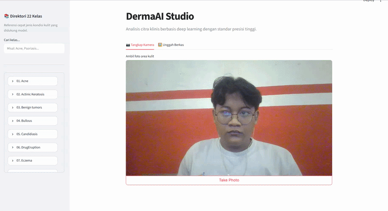
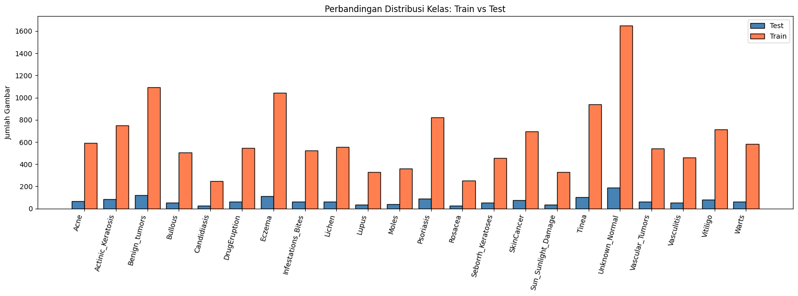
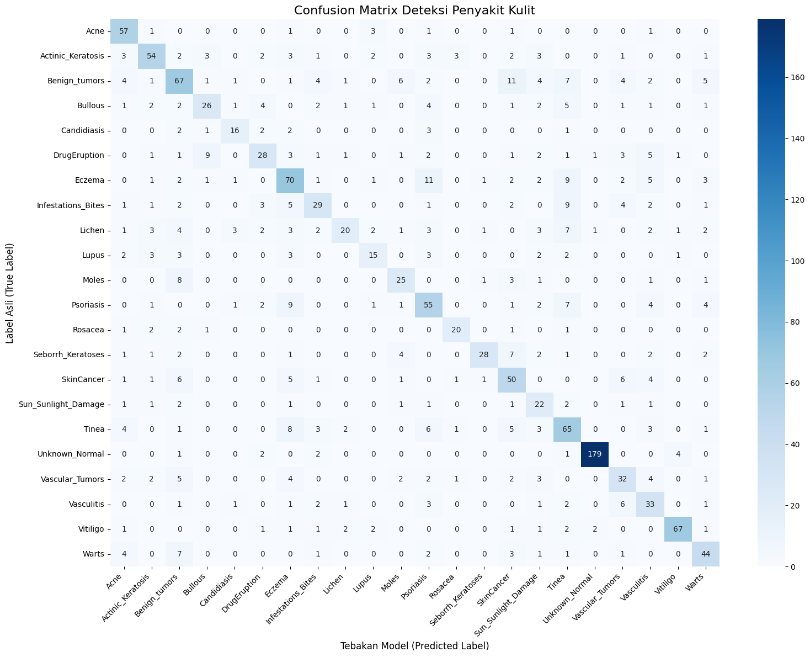

# 🩺 DermaAI — Deteksi Penyakit Kulit Berbasis Deep Learning


Aplikasi web untuk deteksi dini **22 jenis penyakit kulit** dari citra foto menggunakan arsitektur **MobileNetV2** yang dilatih dengan **Transfer Learning** + **Fine-Tuning**.

> ⚠️ **Disclaimer:** Aplikasi ini bersifat **edukasi & eksperimen**, bukan alat diagnosis medis. Selalu konsultasikan kondisi kulit Anda ke **Dokter Spesialis Kulit (Sp.KK / Sp.DV)**.

---

## 📑 Daftar Isi

- [Demo](#-demo)
- [Tentang Model](#-tentang-model)
- [Dataset & Distribusi Kelas](#-dataset--distribusi-kelas)
- [Confusion Matrix](#-confusion-matrix)
- [Hasil Evaluasi](#-hasil-evaluasi)
- [Cara Menjalankan](#-cara-menjalankan)
- [Struktur Proyek](#-struktur-proyek)
- [22 Kelas Penyakit](#-22-kelas-penyakit)
- [Troubleshooting](#-troubleshooting)

---

## 🎬 Demo



> Demo di atas menunjukkan alur penggunaan aplikasi: upload/ambil foto kulit → model memproses gambar → hasil prediksi kelas penyakit beserta tingkat keyakinannya ditampilkan.

---

## 🧠 Tentang Model

### Arsitektur

Model dibangun dengan pendekatan **Transfer Learning** di atas backbone **MobileNetV2** (pretrained ImageNet), kemudian di-**fine-tune** untuk domain dermatologi.

```
Input (224×224×3)
    │
    ├─► Data Augmentation (RandomFlip, RandomRotation, RandomZoom, RandomContrast)
    │
    ├─► MobileNetV2 Preprocess (x/127.5 − 1 → skala [-1, 1])
    │
    ├─► MobileNetV2 Backbone (feature extractor, 2.26M params)
    │     └─ Fine-tuned: layer ke-100 s/d akhir dibuka
    │
    ├─► GlobalAveragePooling2D
    │
    ├─► Dropout (0.2)
    │
    └─► Dense (22, softmax) ← output probabilitas 22 kelas
```

### Detail Teknis

| Properti | Nilai |
|---|---|
| **Backbone** | MobileNetV2 (pretrained ImageNet) |
| **Input size** | 224 × 224 × 3 (RGB) |
| **Jumlah kelas** | 22 |
| **Total parameter** | 2,286,166 (~8.72 MB) |
| **Trainable (fine-tune)** | 1,889,622 (7.21 MB) |
| **Loss** | Sparse Categorical Crossentropy |
| **Optimizer (fase 1)** | Adam, lr = 1e-3 |
| **Optimizer (fase 2)** | Adam, lr = 1e-4 |
| **Batch size** | 32 |
| **Epoch** | 10 (head) + 10 (fine-tune) |
| **Class balancing** | `class_weight` otomatis |
| **Callbacks** | ModelCheckpoint, EarlyStopping, ReduceLROnPlateau |

### Strategi Training

Training dilakukan dalam **2 fase**:

1. **Fase 1 — Feature Extraction**
   Base model dibekukan (`base_model.trainable = False`), hanya head (Dense layer) yang dilatih. Ini mengajari model mengenali fitur-fitur umum kulit.

2. **Fase 2 — Fine-Tuning**
   Layer ke-100 s/d akhir MobileNetV2 dibuka, dilatih dengan **learning rate kecil** (`1e-4`) untuk menyesuaikan representasi ke domain kulit tanpa merusak fitur dasar ImageNet.

3. **Optimasi tambahan:**
   - `class_weight` menangani **imbalance** (jumlah gambar antar kelas tidak merata)
   - `ReduceLROnPlateau` menurunkan LR otomatis jika `val_loss` stagnan
   - `EarlyStopping` menghentikan training jika tidak ada peningkatan

---

## 📊 Dataset & Distribusi Kelas

Dataset berisi **15.523 gambar** yang terbagi menjadi:

| Split | Jumlah Gambar | Proporsi |
|---|---|---|
| **Train** | 13.977 | 90% |
| **Test** | 1.546 | 10% |
| **Total** | 15.523 | 100% |

### Perbandingan Distribusi Train vs Test



> **Insight:** Distribusi train dan test **proporsional** (mirror satu sama lain), menandakan split dataset dilakukan secara stratified — bagus untuk evaluasi yang representatif. Namun, dataset sangat **imbalanced**:
> - Kelas terbanyak: `Unknown_Normal` (**1.651** gambar)
> - Kelas paling sedikit: `Candidiasis` (**248** gambar)
> - **Rasio ~6.6×** — ini sebabnya `class_weight` penting saat training.

<details>
<summary>📋 Tabel Distribusi Lengkap</summary>

| # | Kelas | Train | Test | Total |
|---|---|---|---|---|
| 1 | Acne | 593 | 65 | 658 |
| 2 | Actinic_Keratosis | 748 | 83 | 831 |
| 3 | Benign_tumors | 1.093 | 121 | 1.214 |
| 4 | Bullous | 504 | 55 | 559 |
| 5 | Candidiasis | 248 | 27 | 275 |
| 6 | DrugEruption | 547 | 61 | 608 |
| 7 | Eczema | 1.042 | 112 | 1.154 |
| 8 | Infestations_Bites | 524 | 60 | 584 |
| 9 | Lichen | 554 | 61 | 615 |
| 10 | Lupus | 327 | 34 | 361 |
| 11 | Moles | 361 | 40 | 401 |
| 12 | Psoriasis | 820 | 88 | 908 |
| 13 | Rosacea | 254 | 28 | 282 |
| 14 | Seborrh_Keratoses | 455 | 51 | 506 |
| 15 | SkinCancer | 693 | 77 | 770 |
| 16 | Sun_Sunlight_Damage | 328 | 34 | 362 |
| 17 | Tinea | 937 | 102 | 1.039 |
| 18 | Unknown_Normal | 1.651 | 189 | 1.840 |
| 19 | Vascular_Tumors | 543 | 60 | 603 |
| 20 | Vasculitis | 461 | 52 | 513 |
| 21 | Vitiligo | 714 | 82 | 796 |
| 22 | Warts | 580 | 64 | 644 |
| | **TOTAL** | **13.977** | **1.546** | **15.523** |

</details>

---

## 🎯 Confusion Matrix



### Cara Baca

- **Diagonal utama** (kiri-atas → kanan-bawah) = prediksi **benar** ✅
- **Di luar diagonal** = prediksi **salah** ❌ (misklasifikasi)
- Baris = label **asli**, Kolom = label **prediksi model**

### Insight dari Confusion Matrix

| Observasi | Detail |
|---|---|
| ✅ **Kelas paling akurat** | `Unknown_Normal` — 95% benar (180/189), jelas karena paling banyak data |
| ✅ **Kelas solid** | `Vitiligo` (82%), `Acne` (88%) — fitur visual khas |
| ⚠️ **Kelas tertukar** | `Lichen` sering diprediksi jadi kelas lain (recall cuma 33%) |
| ⚠️ **Confusion antar-kelas** | `Psoriasis` ↔ `Eczema` ↔ `Lichen` sering tertukar — ketiganya mirip secara visual (plak merah bersisik) |
| ⚠️ **Kelas minoritas** | `Candidiasis`, `Lupus`, `Rosacea` — recall rendah karena sedikit sampel |

---

## 📈 Hasil Evaluasi

### Overall Metrics

| Metric | Nilai |
|---|---|
| **Accuracy** | **65%** |
| **Macro Avg (precision / recall / f1)** | 0.64 / 0.62 / 0.62 |
| **Weighted Avg (precision / recall / f1)** | 0.66 / 0.65 / 0.65 |

### Per-Class Performance (Top 5 & Bottom 5)

**🏆 Terbaik:**

| Kelas | Precision | Recall | F1 |
|---|---|---|---|
| Unknown_Normal | 0.98 | 0.95 | 0.96 |
| Vitiligo | 0.91 | 0.82 | 0.86 |
| Acne | 0.68 | 0.88 | 0.77 |
| Rosacea | 0.77 | 0.71 | 0.74 |
| Actinic_Keratosis | 0.72 | 0.65 | 0.68 |

**⚠️ Perlu Perbaikan:**

| Kelas | Precision | Recall | F1 |
|---|---|---|---|
| Lichen | 0.71 | 0.33 | 0.45 |
| Lupus | 0.56 | 0.44 | 0.49 |
| Sun_Sunlight_Damage | 0.41 | 0.65 | 0.50 |
| DrugEruption | 0.61 | 0.46 | 0.52 |
| Vasculitis | 0.47 | 0.63 | 0.54 |

### Catatan

Akurasi **65%** untuk **22 kelas** dengan dataset yang imbalanced sudah cukup wajar, tapi masih ada ruang perbaikan. Beberapa kondisi visual antar kelas memang sangat mirip (misalnya Plaque Psoriasis vs Lichen Planus), sehingga model kesulitan membedakan tanpa konteks klinis tambahan.

---

## 🚀 Cara Menjalankan

### Prasyarat

- **Python** 3.10 / 3.11 (⚠️ hindari 3.12+ karena TF 2.16 belum support penuh)
- **pip** & **virtualenv**
- RAM minimal **4 GB** (TF + model ~1 GB saat runtime)
- OS: Windows / macOS / Linux

### 1. Clone / Siapkan Folder

```bash
git clone <url-repo-kamu>
cd penyakit-kulit/web
```

Atau jika dari zip, extract lalu:

```bash
cd web
```

### 2. Buat Virtual Environment

```bash
python -m venv venv

# Aktivasi
# Linux / macOS:
source venv/bin/activate

# Windows:
venv\Scripts\activate
```

### 3. Install Dependencies

```bash
pip install -r requirements.txt
```

Isi `requirements.txt`:

```txt
streamlit>=1.41.0
tensorflow==2.16.1
pillow==10.4.0
numpy<2.0
```

⚠️ Kalau install TF gagal di Linux, install dulu:

```bash
sudo apt install -y libgl1 libglib2.0-0
```

### 4. Pastikan File Model Ada

Struktur folder harus seperti ini:

```
web/
├── app.py
├── labels.json
├── requirements.txt
└── model_kulit_terbaik.h5    ← harus ada (~24 MB)
```

### 5. Jalankan Aplikasi

```bash
streamlit run app.py
```

Buka browser ke: `http://localhost:8501`

### 6. Akses dari HP (Opsional)

Streamlit mencetak Network URL di terminal, misal:

```
Network URL: http://192.168.1.10:8501
```

Buka IP itu dari HP (harus Wi-Fi yang sama).

📷 Untuk kamera di HP, browser butuh HTTPS. Pakai tunnel:

```bash
ngrok http 8501
```

Buka URL `https://xxxx.ngrok-free.app` dari HP → kamera langsung aktif.

---

## 📁 Struktur Proyek

```
web/
├── app.py                      # Streamlit app utama
├── labels.json                 # 22 nama kelas (urutan wajib sesuai training)
├── requirements.txt            # Dependencies
├── model_kulit_terbaik.h5      # Model terlatih (Keras 2.15 → Keras 3 compat)
├── assets/
│   ├── demo.gif                 # GIF demo penggunaan aplikasi
│   ├── class_distribution.png  # Chart distribusi train vs test
│   └── confusion_matrix.png    # Confusion matrix hasil evaluasi
├── scripts/
│   ├── plot_class_distribution.py   # Generator chart distribusi
│   └── plot_confusion_matrix.py     # Generator confusion matrix
└── venv/                       # Virtual environment (git-ignored)
```

---

## 📚 22 Kelas Penyakit

| # | Kelas | Deskripsi Singkat | Urgensi |
|---|---|---|---|
| 1 | Acne | Jerawat — peradangan kelenjar minyak | Rendah-Sedang |
| 2 | Actinic_Keratosis | Lesi pra-kanker akibat sinar UV | Tinggi |
| 3 | Benign_tumors | Tumor kulit jinak | Rendah |
| 4 | Bullous | Lepuhan pada kulit | Sedang-Tinggi |
| 5 | Candidiasis | Infeksi jamur Candida | Sedang |
| 6 | DrugEruption | Reaksi alergi obat | Sedang-Tinggi |
| 7 | Eczema | Dermatitis atopik | Sedang |
| 8 | Infestations_Bites | Gigitan serangga/parasit | Sedang |
| 9 | Lichen | Lichen Planus (inflamasi kronis) | Sedang |
| 10 | Lupus | Manifestasi kulit autoimun | Tinggi |
| 11 | Moles | Tahi lalat (nevus) | Pantau |
| 12 | Psoriasis | Autoimun, plak bersisik | Sedang-Tinggi |
| 13 | Rosacea | Kemerahan wajah kronis | Sedang |
| 14 | Seborrh_Keratoses | Pertumbuhan jinak seperti lilin | Rendah |
| 15 | SkinCancer | Kanker kulit | Kritis |
| 16 | Sun_Sunlight_Damage | Kerusakan akibat matahari | Sedang |
| 17 | Tinea | Kurap / kadas (jamur) | Sedang |
| 18 | Unknown_Normal | Kulit normal / tidak terklasifikasi | Normal |
| 19 | Vascular_Tumors | Tumor pembuluh darah | Sedang |
| 20 | Vasculitis | Peradangan pembuluh darah | Tinggi |
| 21 | Vitiligo | Kehilangan pigmen | Sedang |
| 22 | Warts | Kutil (HPV) | Rendah-Sedang |

---

## 🐛 Troubleshooting

| Error | Penyebab | Solusi |
|---|---|---|
| `Unknown layer: 'TrueDivide'` | Model disimpan di Keras 2, diload di Keras 3 | Sudah di-handle dengan custom layer di `app.py` |
| `Only input tensors may be passed as positional arguments` | Keras 3 strict positional args | Sudah di-handle via `__call__` override |
| `use_container_width` not supported | Streamlit < 1.41 | Update: `pip install -U streamlit` |
| `Could not find cuda drivers` | Tidak ada GPU NVIDIA | Warning normal, TF pakai CPU |
| Prediksi ngaco / semua kelas sama | `labels.json` urutannya beda dengan training | Pastikan urutan sama persis dengan `class_names` di notebook |
| Loading model lambat (~30 detik pertama) | TF inisialisasi graph | Normal, setelah itu di-cache oleh Streamlit |
| Kamera tidak muncul di HP | Butuh HTTPS | Pakai `ngrok` atau deploy ke Streamlit Cloud |

---

## 🔬 Reproduksi Chart (untuk Kontributor)

Untuk regenerasi `assets/class_distribution.png` dan `assets/confusion_matrix.png`:

```bash
# Buat chart distribusi kelas
python scripts/plot_class_distribution.py

# Buat confusion matrix (butuh akses ke test dataset)
python scripts/plot_confusion_matrix.py
```

---

## 🛠️ Tech Stack

- **Deep Learning:** TensorFlow 2.16 / Keras 3
- **Backbone:** MobileNetV2 (ImageNet pretrained)
- **Web Framework:** Streamlit
- **Image Processing:** Pillow, NumPy
- **Bahasa:** Python 3.10+

---

## 📜 Lisensi

MIT License — bebas digunakan untuk keperluan edukasi & penelitian.

Dilarang menggunakan aplikasi ini sebagai pengganti diagnosis medis profesional.

---

## 🙏 Kredit

- Dataset: Skin Disease Dataset (via Kaggle)
- MobileNetV2: Sandler et al., 2018 (Google)
- Dibuat untuk keperluan pembelajaran Deep Learning & Computer Vision.
